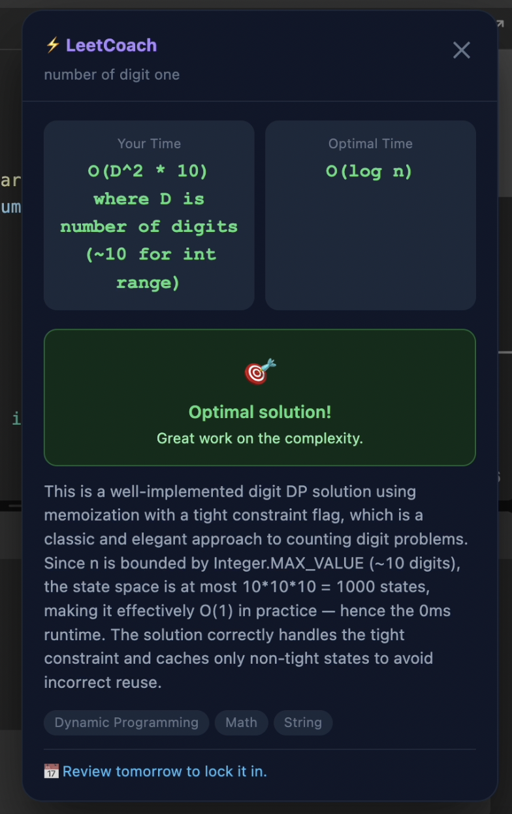
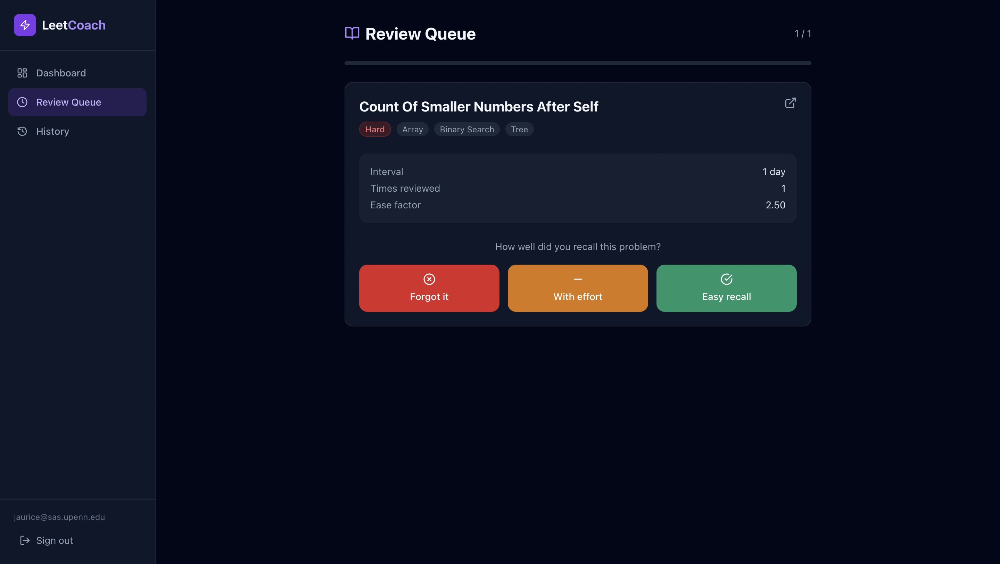

# LeetCoach

An AI-powered LeetCode companion that analyzes your solutions in real time, asks Socratic follow-up questions when you can do better, and schedules problems for spaced repetition review so you actually retain what you learn.


Built with a Chrome extension (MV3), a React web dashboard, three AWS Lambda functions, and Claude AI.

---

## Features

- **Automatic submission detection** — hooks into LeetCode's fetch/XHR pipeline without requiring any manual action
- **AI complexity analysis** — Claude identifies your time and space complexity, compares it to the optimal, and scores how close you were
- **Socratic hints** — instead of just telling you the answer, LeetCoach asks targeted follow-up questions to push your thinking
- **Spaced repetition (SM-2)** — every accepted submission is scheduled for future review based on how well you solved it; the harder the problem, the sooner it comes back
- **Web dashboard** — full submission history, topic breakdown, current streak, and a review queue at [leetcoach.app](https://leetcoach.app)
- **Synced auth** — sign in once via the extension; the same Cognito session works on the website

---

## Demo

https://github.com/user-attachments/assets/83011bd1-7edc-476e-b862-f7e7c9db7f18

## Architecture


```
Chrome Extension (MV3)
  ├── injected.js      Runs in page context — patches window.fetch and XHR
  ├── content.js       Receives submission events, renders analysis panel
  ├── background.js    Service worker — Cognito SRP auth, API calls
  └── popup.html/js    Sign-in UI + mini dashboard with review count

Backend (AWS, deployed via CDK)
  ├── API Gateway      REST API with Cognito authorizer
  ├── Lambda × 3
  │   ├── analyze-submission   POST /submissions/analyze
  │   ├── user-submissions     GET  /submissions
  │   └── review-queue         GET  /reviews/queue  ·  POST /reviews/submit
  ├── DynamoDB         Single-table design with GSI for SRS queue queries
  └── Cognito          User pool — email/password, SRP auth flow

Website (React + Vite + Tailwind)
  ├── /                Landing page
  ├── /login /signup   Auth pages
  ├── /dashboard       Stats, streak, topic breakdown, recent submissions
  ├── /review          SRS review queue — rate each problem: forgot / with effort / easy
  └── /history         Full submission table with filters

AI (Claude via Anthropic API)
  └── Per-submission structured analysis:
      · Time + space complexity (yours vs. optimal)
      · Optimality score (0–1)
      · Socratic follow-up questions
      · One actionable hint
      · Algorithm topics and pattern name
```

---

## How It Works

### 1. Submission Detection

`injected.js` runs in the real page context and monkey-patches `window.fetch` and `XMLHttpRequest` to intercept two LeetCode network calls:

- The GraphQL `submitV2` mutation — captures the `submission_id`
- The `/submissions/detail/:id/check/` polling endpoint — captures the result once judging completes

Results are forwarded via `postMessage` to `content.js`, which passes them to the background service worker.

### 2. AI Analysis

`background.js` sends the code and metadata to `POST /submissions/analyze`. The Lambda builds a structured prompt and calls Claude, asking for:

- Your time/space complexity vs. the known optimal
- An optimality score from 0 to 1
- Whether the solution is fully optimal
- 2–3 Socratic follow-up questions (only if suboptimal)
- One concrete hint
- Relevant algorithm topics

The response is rendered as an overlay panel on the LeetCode page within a few seconds of submission.


### 3. Spaced Repetition (SM-2)

Every submission updates a DynamoDB SRS record using the SM-2 algorithm. The `optimalityScore` from Claude is mapped to a quality rating:

| Optimality | SM-2 Quality | Meaning |
|------------|-------------|---------|
| ≥ 0.90 | 5 | Perfect recall |
| ≥ 0.75 | 4 | Good |
| ≥ 0.50 | 3 | Correct with effort |
| ≥ 0.25 | 2 | Familiar but incorrect |
| < 0.25 | 1 | Barely remembered |

The `nextReview` date is stored and indexed in a GSI so the review queue can be queried efficiently with a single DynamoDB call.

### 4. Review Queue

The website's `/review` page fetches all SRS items due today or earlier, presents each problem one at a time, and lets you rate your recall. Ratings update the SM-2 record and push `nextReview` into the future — easy problems come back in weeks, hard ones tomorrow.



---

## DynamoDB Schema

Single table `leetcoach` with three item types:

| Item | PK | SK | Notes |
|------|----|----|-------|
| User profile | `USER#<userId>` | `PROFILE` | |
| Submission | `USER#<userId>` | `SUB#<iso-ts>#<slug>` | Sorted by time descending |
| SRS record | `USER#<userId>` | `SRS#<slug>` | One per problem |

**GSI1** on SRS records: `GSI1PK = SRS#<userId>`, `GSI1SK = <nextReview ISO>` — enables `GSI1SK <= now` range query for the review queue.

---

## Repo Structure

```
leetcoach/
├── extension/
│   ├── src/
│   │   ├── injected.js       Runs in page context — patches fetch/XHR
│   │   ├── content.js        Submission handling + overlay panel UI
│   │   ├── background.js     Service worker — auth + API calls
│   │   ├── popup.html        Extension popup markup + styles
│   │   └── popup.js          Popup logic — sign-in, dashboard, review count
│   ├── icons/                16 / 48 / 128 px PNGs
│   ├── manifest.json         MV3 manifest
│   ├── build.sh              Injects config vars and bundles with esbuild
│   └── config.example.js     Config template
│
├── backend/
│   ├── lambdas/
│   │   ├── analyze-submission/index.js
│   │   ├── user-submissions/index.js
│   │   └── review-queue/index.js
│   ├── shared/
│   │   ├── db.js             DynamoDB helpers + SM-2 implementation
│   │   └── auth.js           Cognito JWT verification
│   └── package.json
│
├── website/
│   ├── src/
│   │   ├── pages/            LandingPage, AuthPage, DashboardPage,
│   │   │                     ReviewPage, HistoryPage
│   │   ├── components/       Layout, sidebar nav
│   │   ├── hooks/useAuth.ts  Cognito auth hook
│   │   └── lib/api.ts        Typed API client
│   ├── vite.config.ts
│   ├── tailwind.config.js
│   └── package.json
│
└── infrastructure/
    ├── lib/leetcoach-stack.ts  Full CDK stack definition
    ├── bin/leetcoach.ts        CDK app entry point
    └── package.json
```

---

## Setup

### Prerequisites

- Node.js 22+
- AWS CLI configured (`aws configure`)
- AWS CDK installed (`npm install -g aws-cdk`)
- An [Anthropic API key](https://console.anthropic.com)

### 1. Deploy the Backend

```bash
cd infrastructure
npm install
cp .env.example .env
# Add your ANTHROPIC_API_KEY and WEBSITE_URL to .env

npx cdk bootstrap   # first time only
npm run deploy
```

Note the outputs — you'll need them for the next two steps:

```
LeetCoachStack.ApiUrl            = https://xxxxxxxxxx.execute-api.us-east-1.amazonaws.com/prod/
LeetCoachStack.UserPoolId        = us-east-1_XXXXXXXXX
LeetCoachStack.UserPoolClientId  = XXXXXXXXXXXXXXXXXXXXXXXXXX
```

### 2. Set Up the Website

```bash
cd website
npm install
cp .env.example .env.local
# Fill in VITE_API_URL, VITE_USER_POOL_ID, VITE_USER_POOL_CLIENT_ID, VITE_AWS_REGION

npm run dev       # http://localhost:5173
npm run build     # production build → dist/
```

### 3. Build the Chrome Extension

```bash
cd extension

export API_URL=https://xxxxxxxxxx.execute-api.us-east-1.amazonaws.com/prod
export USER_POOL_ID=us-east-1_XXXXXXXXX
export CLIENT_ID=XXXXXXXXXXXXXXXXXXXXXXXXXX

./build.sh
```

Then load it in Chrome:

1. Go to `chrome://extensions`
2. Enable **Developer mode** (top right toggle)
3. Click **Load unpacked** → select `extension/dist/`

---

## Environment Variables

### Backend (infrastructure/.env)

| Variable | Description |
|----------|-------------|
| `ANTHROPIC_API_KEY` | Claude API key |
| `WEBSITE_URL` | Allowed CORS origin (e.g. `https://leetcoach.app`) |

### Website (website/.env.local)

| Variable | Description |
|----------|-------------|
| `VITE_API_URL` | API Gateway base URL |
| `VITE_USER_POOL_ID` | Cognito User Pool ID |
| `VITE_USER_POOL_CLIENT_ID` | Cognito App Client ID |
| `VITE_AWS_REGION` | AWS region (default: `us-east-1`) |

### Extension (build-time env vars for build.sh)

| Variable | Description |
|----------|-------------|
| `API_URL` | API Gateway base URL |
| `USER_POOL_ID` | Cognito User Pool ID |
| `CLIENT_ID` | Cognito App Client ID |

---

## Development

**Extension** — edit files in `extension/src/`, run `./build.sh`, then click the reload icon on `chrome://extensions`. No hot reload, but the build takes under a second.

**Website** — `npm run dev` in `website/` for Vite HMR.

**Backend** — edit Lambda source in `backend/`, then redeploy from `infrastructure/` with `npm run deploy`. CDK only updates functions whose source changed.

**Infrastructure changes** — edit `infrastructure/lib/leetcoach-stack.ts` and run `npm run diff` first to preview changes before deploying.

---

## Tech Stack

| Layer | Technology |
|-------|-----------|
| Extension | Chrome MV3, vanilla JS, esbuild |
| Website | React 18, TypeScript, Vite, Tailwind CSS, Recharts |
| Auth | AWS Cognito (SRP flow via amazon-cognito-identity-js) |
| API | AWS API Gateway (REST) + Lambda (Node.js 22) |
| Database | AWS DynamoDB (single-table, pay-per-request) |
| Infrastructure | AWS CDK (TypeScript) |
| AI | Claude (Anthropic API) |

---

Built by Jaurice · [https://github.com/Frreece]
